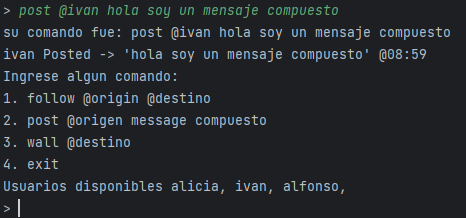
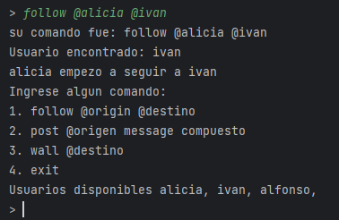
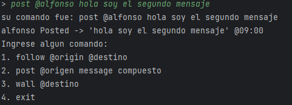
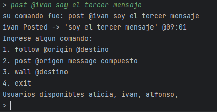
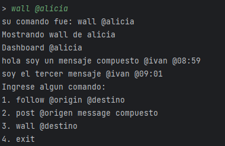
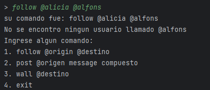
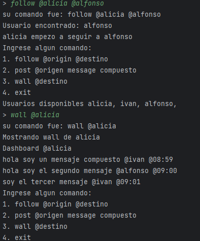
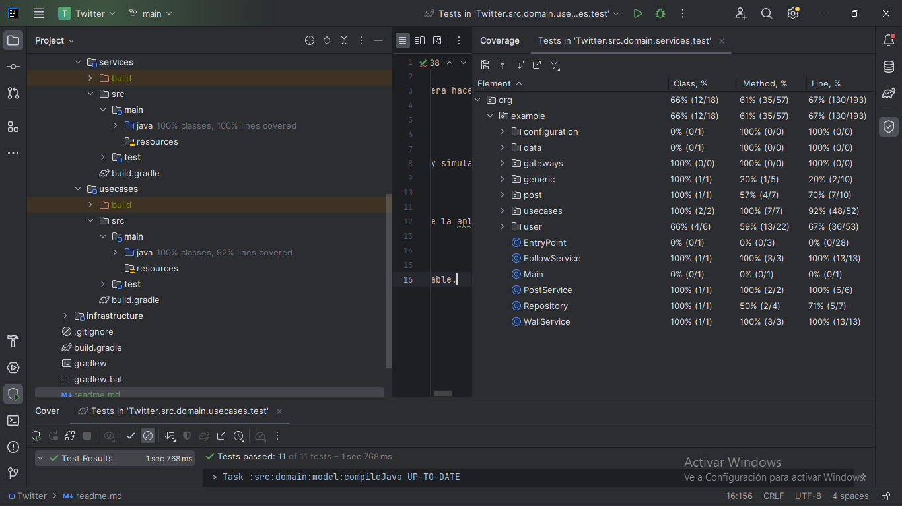

# Clon de twitter usando java!

Se usa java nativo sin librerias ni framework para el desarrollo general de la aplicacion. La idea original ya que se requeria arquitectura hexagonal era hacerla enconjunto con DDD pero debido a que el dominio era pequeño no me parecia lo mas optimo.

## Demostracion de la Applicacion

**Post de ivan**

**Follow de Alicia hacia ivan**

**Post de alfonso**

**Segundo Post de ivan**

**Wall de alicia sin seguir a alfonso**

**Intento de follow por parte de alicia incorrecto**

**Wall de alicia Y follow correcto de alfonso**

# Patrones usados

Utilice el patron de diseño singleton a la hora de usar el repositorio, para poder manejar una unica instancia del repositorio por toda la aplicacion y simular el comportamiento real de una BD. Tambien se me ocurrio pertinente utilizar el patron Value Object en la clase User para que fuera mas diciente el codigo. Procure que los metodos fueran lo mas genericos posibles  (Execute) esto con ayuda de interfaces y genericos intentando cumplir el mayor medida los principios SOLID.

## Arquitectura

La aplicacion se encuentra modularizada en 3 submodulos **Application**, **Domain** e **Infraestructure** dentro de Application se encuentra el main de la aplicacion y los Casos de uso generalmente, aunque acostumbro a poner los casos de uso en la capa del dominio y luego en aplicacion hacer un escaneo. En el Domain se encuentra el servicio que es toda la logica de la aplicacion y el modelo. Por ultimo en la capa de infraestructura se definen todos los puertos externos por ejemplo en este caso por aca ingresa la comunicacion del usuario y la aplicacion. Tambien cree una submodulo dentro de infraestructura para simular lo que seria la BD.

## Testing
Para este caso se implemento la libreria Mockito.

Los modulos probados fueron los UseCases y los servicios, en su respectivo modulo de pruebas se encuentran con una cantidad de coverage bastante aceptable.
